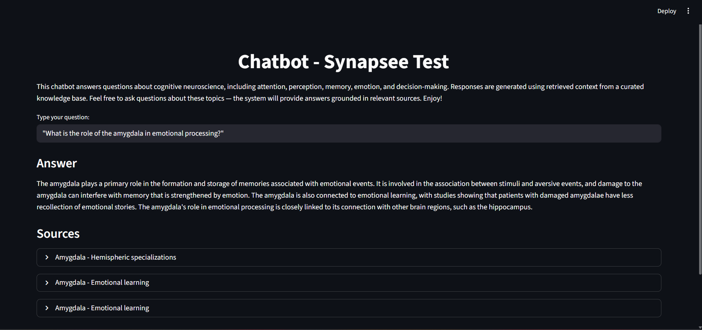

# AI Engineer Project — SynapSee Studio

This repository contains the implementation of a project developed as part of the selection process for an AI Engineer internship at SynapSee Studio.

The goal is to demonstrate skills in building systems that integrate Artificial Intelligence models, as well as proposing a solution to the given problem.

---

## Overview

This project implements a **Retrieval-Augmented Generation (RAG) chatbot** focused on cognitive neuroscience topics such as:

* Attention
* Visual perception
* Memory
* Emotion
* Decision-making

The system retrieves relevant information from a curated knowledge base and generates answers grounded in those sources.

---

## Project Structure

```bash
app/
├── data/
│   └── .gitkeep
│
├── pipeline/
│   ├── __init__.py
│   ├── data_loader.py         # Load raw documents
│   ├── preprocessing.py       # Text cleaning
│   ├── chunking.py            # Text chunking logic
│   ├── build_chunks.py        # Generate chunks
│   ├── build_index.py         # Create FAISS index
│   └── storage.py             # Save/load data
│
├── services/
│   ├── __init__.py
│   ├── search.py              # Vector search (FAISS)
│   └── chatbot.py             # Prompt + LLM generation
│
├── frontend/
│   └── streamlit_app.py       # User interface
│
├── cli.py                     # Command-line interface (testing/debug)
└── __init__.py
```

---

## Design Decisions

### 🔹 Chunking Strategy

* Text is split into overlapping chunks
* Sentence boundaries are preserved to maintain meaning
* Overlap ensures contextual continuity

---

### 🔹 Embeddings & Search

* Model: `all-MiniLM-L6-v2`
* Vector search implemented using **FAISS**
* Top-k retrieval with relevance filtering

---

### 🔹 Prompt Engineering

The system applies:

* **Persona** → defines the model as a neuroscience expert
* **Few-shot example** → guides response format
* **Context restriction** → answers must rely only on retrieved data

---

### 🔹 LLM Integration

* Uses **Groq API (Llama 3)**
* Optimized for performance using a lightweight model (8B)
* Generates answers based on retrieved context

---

### 🔹 Interface

* Built with **Streamlit**
* Allows users to:

  * Ask questions
  * View generated answers
  * See source references used in the response

---

## How to Run

### 1. Clone the repository

```bash
git clone https://github.com/feliperibeiro8/synapsee_test.git
cd synapsee_test
```

---

### 2. Create a virtual environment (optional)

```bash
python -m venv venv
venv\Scripts\activate  # Windows
```

---

### 3. Install dependencies

```bash
pip install -r requirements.txt
```

---

### 4. Configure environment variables

Create a `.env` file:

```env
GROQ_API_KEY=your_api_key_here
```

You can get your API key on https://console.groq.com/

---

### 5. Generate data (only required once)

```bash
python app/pipeline/build_chunks.py
python app/pipeline/build_index.py
```

---

### 6. Run the application

```bash
python -m streamlit run app/frontend/streamlit_app.py
```

---

## 💬 Example Questions

* What is the amygdala?
* Explain attention in cognitive neuroscience
* What is visual perception?

---

## Interface Preview

### Question Example


--- 

## Limitations

* Answers depend on the available knowledge base
* External API latency may affect response time
* Free-tier API limits may restrict usage

---

## Future Improvements

* Deploy on AWS (EC2 / ECS)
* Replace Streamlit with a full frontend
* Use managed vector databases
* Add authentication and user sessions

---

## Conclusion

This project demonstrates a complete RAG pipeline, from data processing and semantic search to LLM-based answer generation and user interaction.
